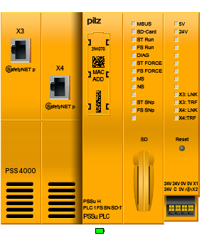
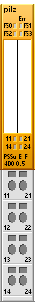
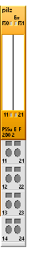
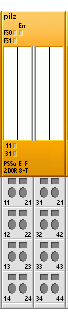
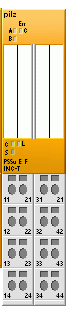
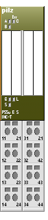
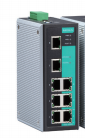

# TMA IS Equipment General Description

| **Requested by:**           | **Ghesa**          |
|-----------------------------|--------------------|
| **Doc. Code:**              | 3151_MCS_0008      |
| **Editor:**                 | Julen              |
| **Approved by:**            | Alberto            |

## Introduction

This document contains the general equipment description of the TMA interlock system, based on the PSS4000 series by PILZ.

## Reference documents

| **Nº** | **Document**               | **Code**           | **Version** |
|--------|--------------------------------------------------------------------------|--------------------|-------------|
| **1**  | Safety Review and Hazard Analysis                                        | 092-308-E-Z-00001  | (Draft 2)   |
| **2**  | LSST Summit Safety Interlock System                                      | LTS-99             |             |
| **3**  | Telescope Mount Assembly to Interlock System Interface Control Document” | LTS-173            |             |
| **4**  | TMA Safety Hazard Analysis 24-04-2013                                    | 14428              | V2          |
| **5**  | TMA IS HW Design Report                                                  | 3151_MCS_0007      | 3.0         |
| **6**  | MCS Equipment General Description                                        | 3151_MCS_0004      | 3.0         |

## Safety Hardware

This section includes the main characteristics of the hardware devices used in the TMA IS hardware configuration, which
are based on PILZ devices.

### PILZ PSS 4000 Universal

The hardware shown in the following chapter is the solution adopted to manage all the safety on the TMA.
This solution is based on the PSS4000 family. There is one main Failsafe CPU in the main cabinet, with local I/Os on the same rack,
and inputs and outputs distributed in the auxiliary cabinets connected to the main CPU via PILZ proprietary SafetyNET network.

#### Safety CPU PSSu H PLC1 FS SN SD-T

This is a Safety CPU with two SafetyNET connections. Used on the main cabinet, as the principal safety controller.

It can be expandable with safe and standard inputs and outputs on its right side.

The head module belongs to the performance class "Control system PSSu PLC". It can be used to connect a PSSu system to a
SafetyNET p. The head module has the following features:

- 2 free switch ports for connection to SafetyNET p
- One FS resource and one ST resource
- SD card used to store the device project and the naming data
- Reset button
  - For warm reset
  - To transfer the naming data and/or device project from the SD card to the device memory
- Supply voltage
  - Integrated supply voltage for periphery supply and module supply
  - Module supply is buffered for 20 ms if the supply voltage is interrupted
  - Plug­in connection terminals (either spring­loaded terminal or screw terminal)
- Status LEDs
- Supports FS and ST modules
- T-type for increased environmental requirements

##### Technical details for PSS 4000 CPU

| **General**                       |      |
|-----------------------------------|------|
| Approvals                         | **BG, CE, EAC (Eurasian), GOST, TÜV, cULus Listed**|
| Application range                 | **Standard / failsafe**|
| **System sections**               | **314070**   |
| ST resource                       | **Yes**      |
| FS resource                       | **Yes**      |
| ST module bus                     | **Yes**      |
| FS module bus                     | **Yes**      |
| ST SNp interface                  | **Yes**      |
| FS SNp interface                  | **Yes**      |
| PROFIBUS­DP Slave                  | **No**       |
| IP Connections                    | **Yes**      |
| EtherNet/IP adapter               | **Yes**      |
| Diagnostic Server                 | **No**       |
| OPC Server                        | **No**       |
| **Programming**                   |              |
| IEC 61131 programming             | **Yes**      |
| Multi programming                 | **Yes**      |
| Non­volatile variables             | **Yes**      |
| Supply voltage for                | **Module supply**   |
| Voltage                           | **24,0 V**   |
| Kind                              | **DC**       |
| Voltage tolerance                 | **­30 %/+25 %** |
| Max. continuous current that the external power supply must provide | **1,0 A**    |
| Output of external power supply (DC)                                | **16,0 W**   |
|  Supply voltage for               | **Periphery supply**|
| Voltage                           | **24 V**     |
| Kind                              | **DC**       |
| Voltage tolerance                 | **­30 %/+25 %**     |
| Max. continuous current that the external power supply must provide | **10,0 A**   |
| Potential isolation between module supply and periphery supply      | **3050 V**   |
| **Electrical data**               |              |
| Internal supply voltage (module supply)               |              |
| Output voltage                    | **int. system**     |
| Voltage                           | **5 V**      |
| Voltage tolerance                 | **­2 %/+3 %** |
| Potential isolation               | **3050 V**   |
| Current load capacity             | **2,0 A**    |
| Buffer in the case of supply interruptions in accordance with | **EN 61131­2, EN 61496­1** |
| Short circuit­proof                | **Yes**      |
| **CPU**                           |              |
| Real­time clock for time and date, buffered |              |
| Resolution                        | **1 s**      |
| Deviation                         | **+/­ 10s/Day**     |
| Buffer time                       | **10 days**  |
| Max. number of FS tasks           | **9**        |
| Max. number of ST tasks           | **9**        |
| Max. number of variables with elementary data types on the FS resource | **10.000**   |
| Max. number of variables with elementary data types on the ST resource | **10.000**   |
| Min. cycle time, FS tasks         | **6 ms**     |
| Min. cycle time, ST tasks         | **2 ms**     |
| Working memory (RAM)              | **128 MB**   |
|  Memory for the user program per resource             | **4 MB**     |
| **Removable data medium**         |              |
| Type                              | **SD card**  |
| External communication            |              |
| Max. number of IP connections     | **32**       |
| Modbus/TCP Cycle time (t_ExtCo)   | **2...2 000 000 ms**|
| Raw UDP Cycle time (t_ExtCo)      | **2...2 000 000 ms**|
| **SafetyNET p interface**         |              |
| Number                            | **2**        |
| IP address (automatically off)    | **169.254.X.Y**     |
| Connection                        | **RJ45**     |
| Transmission rates                | **100 MBit/s**      |
| Set via                           | **automatic**|
| Max. number of FS-Tx and FS-Rx connections | **64**       |
| Max. number of ST-Tx and ST-Rx connections | **64**       |
| Cycle time (t_SNp)                | **2..60000ms**      |
| Max. number of variables with elementary ST data types | **5000**     |
| Max. number of variables with elementary FS data types | **4000**     |
| **Environmental data** |              |
| Climatic suitability   | **EN 60068­2­1, EN 60068­2­14, EN 60068­2­2, EN 60068­2­30, EN 60068­2­78**                      |
| Ambient temperature    |              |
| Temperature range      | **-40 ­ 70 °C**     |
| Storage temperature    |              |
| Temperature range      | **­40 ­ 70 °C**     |
| Climatic suitability   |              |
| In accordance with the standard                       | **EN 60068­2­78**   |
| Humidity        | **93 % r. h. at 40 °C**|
| Condensation during operation                         | **Short-term**      |
| EMC             | EN 61000­4­2, EN 61000­4­3, EN 61000­4­4, EN 61000­4­5, EN 61000­4­6, EN 61000­6­2, EN 61000­6­4 |
| Vibration       |              |
| In accordance with the standard                       | **EN 60068­2­6**    |
| Frequency       | **10,0 ­ 55,0 Hz**  |
| Amplitude       | **0,35 mm**  |
| Acceleration    | **1g**       |
| Shock stress    |              |
| In accordance with the standard                       | **EN 60068­2­27**   |
| Number of shocks| **6**        |
| Acceleration    | **15g**      |
| Duration        | **11 ms**    |
| In accordance with the standard                       | **EN 60068­2­27**   |
| Number of shocks| **1000**     |
| Acceleration    | **10g**      |
| Duration        | **16 ms**    |
| Max. operating height above sea level                 | **5000 m**   |
| Airgap creepage |              |
| In accordance with the standard                       | **EN 60664­1**      |
| OverVoltage category   | **II**       |
| Pollution degree| **2**        |
| Protection type |              |
| Mounting area (e.g. control cabinet)                  | **IP54**     |
| Housing         | **IP20**     |
| **Mechanical data**    |              |
| Material        |              |
| Bottom          | **PC**       |
| Connection type | **Spring­loaded terminal, screw terminal**         |
| Mounting type   | **plug­in**  |
| Conductor cross section with screw terminals          |              |
| 1 core flexible | **0,25 ­ 2,50 mm², 24 ­ 12 AWG**                   |
| 2 core with the same cross section, flexible with crimp connectors, no plastic sleeve               |              |
|                 | **0,25 ­ 1,00 mm², 24 ­ 16 AWG**                   |
| 2 core with the same cross section, flexible without crimp connectors or with TWIN crimp connectors |              |
|                 | **0,20 ­ 1,50 mm², 24 ­ 16 AWG**                   |
| Torque setting with screw terminals                   | **0,50 Nm**  |
| Conductor cross section with spring­loaded terminals: |              |
| Flexible with/without crimp connector                 | **0,20 ­ 2,50 mm², 24 ­ 12 AWG**                   |
| Stripping length with spring­loaded terminals         | **9,0 mm**   |
| Dimensions      |              |
| Height          | **125,6 mm** |
| Width           | **130,0 mm** |
| Depth           | **83,7 mm**  |
| Weight          | **378 g**    |

| **Safety characteristic data** |                  |
|--------------------------------|------------------|
| EN ISO mode 13849­1: 2008 PL    | **PL e**         |
| EN ISO 13849­1: 2008 Category   | **Cat. 4**       |
| EN 62061 SIL CL                | **SIL CL 3**     |
| EN 62061 PFH  [1/h]            | **4,14E-9**      |
| IEC 61511 SIL                  | **SIL 3**        |
| IEC 61511 PFD                  | **3,51E-5**      |
| EN ISO 13849­1: 2008 TM [year]  | **20**           |

#### Safety I/O PSSu H FS SN SD-T

This is a distributed I/Os with two SafetyNET connections. It can be expandable with safe and standard inputs and outputs
on its right side.

The head module belongs to the performance class "Decentralised system PSSu I/O". It can be used to connect a PSSu system
to SafetyNET p. The head module has the following features:

- 2 free switch ports for connection to SafetyNET p
- Standard module bus for standard I/O modules
- SD card used to store the device project and the naming data
- Supply voltage
  - Integrated supply voltage for periphery supply and module supply
  - Module supply is buffered for 20 ms if the supply voltage is interrupted
  - Plug­in connection terminals (either spring­loaded terminal or screw terminal)
- Status LEDs
- T-type for increased environmental requirements

##### Technical details for PSSu H FS SN SD-T

| **General 314085**     |              |
|------------------------|--------------|
| Approvals       | **BG, CE, EAC (Eurasian), GOST, TÜV, cULus Listed**|
| Application range      | **Standard / failsafe**|
| **System sections 314085**|              |
| ST resource     | **No**       |
| FS resource     | **No**       |
| ST module bus   | **Yes**      |
| FS module bus   | **Yes**      |
| ST SNp interface| **Yes**      |
| FS SNp interface| **Yes**      |
| PROFIBUS­DP Slave      | **No**       |
| IP Connections  | **No**       |
| Diagnostic Server      | **No**       |
| OPC Server      | **No**       |
| **Programming** |              |
| IEC 61131 programming  | **No**       |
| Multi programming      | **No**       |
| Non­volatile variables | **No**       |
| Supply voltage for     | **Module supply**   |
| Voltage         | **24,0 V**   |
| Kind            | **DC**       |
| Voltage tolerance      | **­30 %/+25 %**     |
| Max. continuous current that the external power supply must provide                                 | **1,0 A**    |
| Output of external power supply (DC)                  | **16,0 W**   |
|  Supply voltage for    | **Periphery supply**|
| Voltage         | **24 V**     |
| Kind            | **DC**       |
| Voltage tolerance      | **­30 %/+25 %**     |
| Max. continuous current that the external power supply must provide                                 | **10,0 A**   |
| Potential isolation between module supply and periphery supply                                      | **3050 V**   |
| **Electrical data**    |              |
| Internal supply voltage (module supply)               |              |
| Output voltage  | **int. system**     |
| Voltage         | **5 V**      |
| Voltage tolerance      | **­2 %/+3 %**|
| Potential isolation    | **3050 V**   |
| Current load capacity  | **2,0 A**    |
| Buffer in the case of supply interruptions in accordance with                                       | **EN 61131­2, EN 61496­1**                         |
| Short circuit­proof    | **Yes**      |
| **CPU**         |              |
| Real­time clock for time and date, buffered           |              |
| Resolution      | **1 s**      |
| Deviation       | **+/­ 10s/Day**     |
| Buffer time     | **10 days**  |
| Working memory (RAM)   | **64 MB**    |
| **Removable data medium** |              |
| Type            | **SD card**  |
| External communication |              |
| Max. number of IP connections                         | **32**       |
| Modbus/TCP Cycle time (t_ExtCo)                       | **2...2 000 000 ms**|
| Raw UDP Cycle time (t_ExtCo)                          | **2...2 000 000 ms**|
| **SafetyNET p interface** |              |
| Number          | **2**        |
| IP address (automatically off)                        | **169.254.X.Y**     |
| Connection      | **RJ45**     |
| Transmission rates     | **100 MBit/s**      |
| Set via         | **automatic**|
| Max. number of FS-Tx and FS-Rx connections            | **64**       |
| Max. number of ST-Tx and ST-Rx connections            | **64**       |
| Cycle time (t_SNp)     | **2..60000ms**      |
| Max. number of variables with elementary ST data types| **5000**     |
| Max. number of variables with elementary FS data types| **4000**     |
| **Environmental data** |              |
| Climatic suitability   | **EN 60068­2­1, EN 60068­2­14, EN 60068­2­2, EN 60068­2­30, EN 60068­2­78**                      |
| Ambient temperature    |              |
| Temperature range      | **-40 ­ 70 °C**     |
| Storage temperature    |              |
| Temperature range      | **­40 ­ 70 °C**     |
| Climatic suitability   |              |
| In accordance with the standard                       | **EN 60068­2­78**   |
| Humidity        | **93 % r. h. at 40 °C**|
| Condensation during operation                         | **Short-term**      |
| EMC             | EN 61000­4­2, EN 61000­4­3, EN 61000­4­4, EN 61000­4­5, EN 61000­4­6, EN 61000­6­2, EN 61000­6­4 |
| Vibration       |              |
| In accordance with the standard                       | **EN 60068­2­6**    |
| Frequency       | **10,0 ­ 55,0 Hz**  |
| Amplitude       | **0,35 mm**  |
| Acceleration    | **1g**       |
| Shock stress    |              |
| In accordance with the standard                       | **EN 60068­2­27**   |
| Number of shocks| **6**        |
| Acceleration    | **15g**      |
| Duration        | **11 ms**    |
| In accordance with the standard                       | **EN 60068­2­27**   |
| Number of shocks| **1000**     |
| Acceleration    | **10g**      |
| Duration        | **16 ms**    |
| Max. operating height above sea level                 | **5000 m**   |
| Airgap creepage |              |
| In accordance with the standard                       | **EN 60664­1**      |
| OverVoltage category   | **II**       |
| Pollution degree| **2**        |
| Protection type |              |
| Mounting area (e.g. control cabinet)                  | **IP54**     |
| Housing         | **IP20**     |
| **Mechanical data**    |              |
| Material        |              |
| Bottom          | **PC**       |
| Connection type | **Spring­loaded terminal, screw terminal**         |
| Mounting type   | **plug­in**  |
| Conductor cross section with screw terminals          |              |
| 1 core flexible | **0,25 ­ 2,50 mm², 24 ­ 12 AWG**                   |
| 2 core with the same cross section, flexible with crimp connectors, no plastic sleeve               |              |
|                 | **0,25 ­ 1,00 mm², 24 ­ 16 AWG**                   |
| 2 core with the same cross section, flexible without crimp connectors or with TWIN crimp connectors |              |
|                 | **0,20 ­ 1,50 mm², 24 ­ 16 AWG**                   |
| Torque setting with screw terminals                   | **0,50 Nm**  |
| Conductor cross section with spring­loaded terminals: |              |
| Flexible with/without crimp connector                 | **0,20 ­ 2,50 mm², 24 ­ 12 AWG**                   |
| Stripping length with spring­loaded terminals         | **9,0 mm**   |
| Dimensions      |              |
| Height          | **125,6 mm** |
| Width           | **130,0 mm** |
| Depth           | **83,7 mm**  |
| Weight          | **378 g**    |

| **Safety characteristic data** |                  |
|--------------------------------|------------------|
| EN ISO mode 13849­1: 2008 PL    | **PL e**         |
| EN ISO 13849­1: 2008 Category   | **Cat. 4**       |
| EN 62061 SIL CL                | **SIL CL 3**     |
| EN 62061 PFH  [1/h]            | **4,14E-9**      |
| IEC 61511 SIL                  | **SIL 3**        |
| IEC 61511 PFD                  | **3,51E-5**      |
| EN ISO 13849­1: 2008 TM [year]  | **20**           |

#### Digital input module: PSSu EF 4DI-T

A 4 safety digital input module.

The product has the following features:

- 4 digital inputs
- 2 test pulse outputs, with the option to configure them as:
  - Independent test pulse outputs that use different test pulses (periphery supply)
  - Outputs with constant voltage (periphery supply)
- LEDs for:
  - Switch status of each input
  - Module error
- T-type for increased environmental requirements
- For failsafe applications in system environments A and B

##### Technical details for PSSu E F 4 DI-T

| **General** | **314200**    |
|-------------|---------------|
| Approvals             | **BG, CE, EAC (Eurasian), KOSHA, TÜV, cULus Listed**   |
| Application Range     | **Failsafe**     |
| Module’s device code  | **0A00h**        |
| Number of FS input bits                                             | **4**            |
| Application in system environment A                                 |                  |
| From FS firmware version, other head modules                        | **4**            |
| From FS firmware version PSSu H F PN                                | **1**            |
| Application in system environment B                                 |                  |
| From FS firmware version, head modules                              | **1.0.0**        |
| **Electrical data**   |                  |
| Internal supply voltage (module supply)                             |                  |
| Supply voltage range of module supply                               | **4,8 ­ 5,4 V**  |
| Module's current consumption                                        | **23 mA**        |
| Module's power consumption                                          | **0,12 W**       |
| Periphery's supply voltage (periphery supply)                       |                  |
| Voltage range         | **16,8 ­ 30 V**  |
| Module's current consumption with no load                           | **8 mA**         |
| Module's power consumption with no load                             | **0,19 W**       |
| Max. power dissipation of module                                    | **1,5 W**        |
| **Inputs**            |                  |
| Number                | **4**            |
| Voltage at inputs     | **24 V DC**      |
| Input current at rated voltage                                      | **6 mA**         |
| Input current range   | **2,6 ­ 7,8 mA** |
| Min. threshold voltage when signal changes from "1" to "0"          | **9 V**          |
| Max. threshold voltage when signal changes from "0" to "1"          | **10 V**         |
| Max. processing time of input when signal changes from "1" to "0"   |  **1 ms**        |
| Max. processing time of input when signal changes from "0" to "1"   |  **1 ms**        |
| Min. processing time of in­ put when signal changes from "1" to "0" |  **0,5 ms**      |
| Min. processing time of in­ put when signal changes from "0" to "1" |  **0,5 ms**      |
| Potential isolation between input and internal module bus voltage   |  **Yes**         |
| **Test pulse outputs**|                  |
| Number of test pulse outputs                                        | **2**            |
| Voltage, test pulse outputs                                         | **24 V DC**      |
| Short circuit proof   | **Yes**          |
| Number of outputs that can be configured as test pulses             | **2**            |
| Max. output current at "1" signal                                   | **0,25 A**       |
| Max. cable length between test pulse output and input               | **200 m**        |
| Standard for voltage interruptions                                  | **EN61131­2, EN61496­1**|
| **Environmental data**|                  |
| Climatic suitability  | **EN 60068­2­1, EN 60068­2­14, EN 60068­2­2, EN 60068­2­30, EN 60068­2­78**                          |
| Ambient temperature   |                  |
| In accordance with the standard                                     | **EN 60068­2­14**|
| Temperature range     | **-40 ­ 60 °C**  |
| Storage temperature   |                  |
| In accordance with the standard                                     | **EN 60068­2­1/­2**     |
| Temperature range     | **­40 ­ 70 °C**  |
| Climatic suitability  |                  |
| In accordance with the standard                                     | **EN 60068-2-30, EN 60068-2-78**                       |
| Humidity              | **93 % r. h. at 40ºC**  |
| Condensation during operation                                       | **Short term**   |
| EMC                   | **EN 61000-4-2, EN 61000-4-3, EN 61000-4-4, EN 61000-4-5, EN 61000-4-6, EN 61000-6-2, EN 61000-6-4** |
| Vibration             |                  |
| In accordance with the standard                                     | **EN 60068-2-6** |
| Frequency             | **10 – 150 Hz**  |
| Amplitude             | **0,35 mm**      |
| Acceleration          | **1 g**          |
| Shock stress          |                  |
| In accordance with the standard                                     | **EN 60068-2-27**|
|  Number of shocks     | **6**            |
| Acceleration          | **15 g**         |
| Duration              | **11 ms**        |
| In accordance with the standard                                     | **EN 60068-2-27**|
| Number of shocks      | **1000**         |
| Acceleration          | **10 g**         |
| Duration              | **16 ms**        |
| Max operating height above sea level                                | **5000 m**       |
| Airgap creepage       |                  |
| In accordance with the standard                                     | **EN 60664-1**   |
| OverVoltage category  | **II**           |
| Pollution degree      | **2**            |
| Protection type       |                  |
| In accordance with the standard                                     | **EN 60529**     |
| Mounting area (e.g. control cabinet)                                | **IP54**         |
| Housing               | **IP20**         |
| Terminals             | **IP20**         |
| **Mechanical data**   |                  |
| Material              |                  |
| Bottom                | **PC**           |
| Front                 | **PC**           |
| Coding                | **PA**           |
| Mounting type         | **plug­in**      |
| Dimensions            |                  |
| Height                | **76 mm**        |
| Width                 | **12,6 mm**      |
| Depth                 | **60,2 mm**      |
| Weight                | **36 g**         |
| Mechanical coding     |                  |
| Type                  | **D**            |
| Color                 | **Yellow**       |

| **Safety characteristic data** |        |        |        |        |        |        |        |
|--------------------------------|--------|--------|--------|--------|--------|--------|--------|
| **Operating mode** | EN ISO 13849­1: 2008 PL | EN ISO 13849­1: 2008 Category | EN 62061 SIL CL | EN 62061 PFH [1/h] | IEC 61511 SIL | IEC 61511 PFD | EN ISO 13849­1: 2008 TM [year] |
| 1-­channel          | **PL d**               | **Cat. 2**                   | **SIL CL 2**    | **9,00E-9**        | **SIL 2**     | **7,89E­-4**   | **20**                        |
| 2-channel          | **PL e**               | **Cat. 4**                   | **SIL CL 3**    | **3,10E-9**        | **SIL 3**     | **1,85E-5**   | **20**                        |
| 2­ch. pulsed        | **PL e**               | **Cat. 4**                   | **SIL CL 3**    | **3,10E-9**        | **SIL 3**     | **1,85E­-5**   | **20**                        |
| 1-ch., pulsed light barrier | **PL e**      | **Cat. 4**                   | **SIL CL 3**    | **2,91E-9**        | **SIL 3**     | **7,52E-5**   | **20**                        |

There is an extended temperature range model, that admits operating temperature between -40ºC and +70ºC degrees.
This model is used in the cabinets without temperature control.

#### Digital output module: PSSu E F 4DO 0.5-T

4 safe digital output module, with maximum 0.5 A each output

Figure 4 - E F 4DO 0.5

The product has the following features:

- 4 Digital outputs
  - Semiconductor technology
  - Single pole
  - Positive switching
  - Current load capacity per output: 0,50 A
  - Short circuit proof
  - Overload proof
  - Free from feed
- LEDs
- Switch status per ou
  - FS enable per output
  - Module e
- For failsafe applications in system environment A and B
- T-type for increased environmental requirements

##### Technical details for PSSuE F 4DO 0.5

| **General**                        | **314210**       |
|------------------------------------|------------------|
| Approvals                          | **BG, CE, GOST, TÜV, cULus Listed**                    |
| Application range                  | **Failsafe**     |
| Module's device code               | **0C01h**        |
| Number of FS output bits           | **4**            |
| Application in system environment A|                  |
| From FS firmware version, other head modules                                     | **4**            |
| From FS firmware version PSSu H F PN                                             | **1**            |
| Application in system environment B|                  |
| From FS firmware version, head modules                                           | **1.0.0**        |
| **Electrical data**                |                  |
| Internal supply voltage (module supply)                                          |                  |
| Supply voltage range of module supply                                            | **4,8 ­ 5,4 V**  |
| Module's current consumption       | **56 mA**        |
| Module's power consumption         | **0,28 W**       |
| Periphery's supply voltage (periphery supply)                                    |                  |
| Voltage range                      | **16,8 ­ 30,0 V**|
| Module's current consumption with no load                                        | **37 mA**        |
| Module's power consumption with no load                                          | **0,90 W**       |
| Max. power dissipation of module   | **1,50 W**       |
| Terminal voltage when switching off inductive loads                              |  **U2 ­ 50 V**   |
| Permitted loads                    | **inductive, capacitive, resistive**                   |
| **Semiconductor outputs**          |                  |
| Number of positive­ switching single­pole semiconductor outputs                  |  **4**           |
| Voltage| **24 V DC**      |
| Typ. output current at "1" signal and rated voltage of semiconductor output      |  **0,50 A**      |
| Permitted current range            | **0,00 ­ 0,62 A**|
| Residual current at "0" signal     | **0,02 mA**      |
| Max. transient pulsed current      | **6 A**          |
| Max. internal voltage drop         | **300 mV**       |
| Monitoring threshold of semiconductor output                                     | **6,0 V**        |
| Max. duration of on time during self test                                        | **200 µs**       |
| Max. duration of off time during self test                                       | **350 µs**       |
| Max. processing time of semiconductor output when signal changes from "1" to "0" |  **0,020 ms**    |
| Max. processing time of semiconductor output when signal changes from "0" to "1" |  **0,010 ms**    |
| Potential isolation from system voltage                                          | **Yes**          |
| Short circuit­proof                | **Yes**          |
| **Environmental data**             |                  |
| Climatic suitability               | **EN 60068­2­1, EN 60068­2­14, EN 60068­2­2, EN 60068­2­30, EN 60068­2­78**                          |
| Ambient temperature                |                  |
| In accordance with the standard    | **EN 60068­2­14**|
| Temperature range                  | **-40 ­ 70 °C**  |
| Storage temperature                |                  |
| In accordance with the standard    | **EN 60068­2­1/­2**     |
| Temperature range                  | **­40 ­ 70 °C**  |
| Climatic suitability               |                  |
| In accordance with the standard    | **EN 60068­2­30, EN 60068­2­78**                       |
| Humidity                           | **93 % r. h. at 40 °C** |
| Condensation during operation      | **Short-term**   |
| EMC | **EN 61000­4­2, EN 61000­4­3, EN 61000­4­4, EN 61000­4­5, EN 61000­4­6, EN 61000­6­2, EN 61000­6­4** |
| Vibration                          |                  |
| In accordance with the standard    | **EN 60068­2­6** |
| Frequency                          | **10,0 ­ 150,0 Hz**     |
| Amplitude                          | **0,35 mm**      |
| Acceleration                       | **1g**           |
| Shock stress                       |                  |
| In accordance with the standard    | **EN 60068­2­27**|
| Acceleration                       | **15g**          |
| Duration                           | **11 ms**        |
| In accordance with the standard    | **EN 60068­2­29**|
| Acceleration                       | **10g**          |
| Duration                           | **16 ms**        |
| Max operating height above sea level                                             | **5000 m**       |
| Airgap creepage                    |                  |
| In accordance with the standard    | **EN 60664-1**   |
| OverVoltage category               | **II**           |
| Pollution degree                   | **2**            |
| Protection type                    |                  |
| In accordance with the standard    | **EN 60529**     |
| Mounting area (e.g. control cabinet)                                             | **IP54**         |
| Housing| **IP20**         |
| Terminals                          | **IP20**         |
| **Mechanical data**                |                  |
| Material                           |                  |
| Bottom | **PC**           |
| Front  | **PC**           |
| Coding | **PA**           |
| Mounting type                      | **plug­in**      |
| Dimensions                         |                  |
| Height | **76 mm**        |
| Width  | **12,6 mm**      |
| Depth  | **60,2 mm**      |
| Weight | **38 g**         |
| Mechanical coding                  |                  |
| Type| **E**            |
| Color | **Yellow**       |

| **Safety characteristic data** |        |        |        |        |        |        |        |
|--------------------------------|--------|--------|--------|--------|--------|--------|--------|
| **Operating mode** | EN ISO 13849­1: 2008 PL | EN ISO 13849­1: 2008 Category | EN 62061 SIL CL | EN 62061 PFH [1/h] | IEC 61511 SIL | IEC 61511 PFD | EN ISO 13849­1: 2008 TM [year] |
| 1-­channel          | **PL d**               | **Cat. 2**                   | **SIL CL 2**    | **9,00E-9**        | **SIL 2**     | **7,89E­-4**   | **20**                        |
| 2-channel          | **PL e**               | **Cat. 4**                   | **SIL CL 3**    | **1,13E-9**        | **SIL 3**     | **1,66E-5**   | **20**                        |

There is an extended temperature range model, that admits operating temperature between -40ºC and +70ºC degrees.
This model is used in the cabinets without temperature control.

#### Digital output module: PSSu E F 2DO 2-T

Two safe digital output module, with maximum 2 A for each output.

The product has the following features:

- 2 Digital outputs
  - Semiconductor technology
  - Single pole
  - Positive switching
  - Current load capacity per output: 2,00 A
  - Short circuit proof
  - Overload proof
  - Free from feedback
- LEDs
- Switch status per output
  - FS enable per output
  - Module error
- For failsafe applications in system environment A and B
- T-type for increased environmental requirements

##### Technical details for PSSu E F 2DO 2

| **General**                        | **312215**       |
|------------------------------------|------------------|
| Approvals                          | **BG, CE, GOST, TÜV, cULus Listed**                    |
| Application range                  | **Failsafe**     |
| Module's device code               | **0C00h**        |
| Number of FS output bits           | **2**            |
| Application in system environment A|                  |
| From FS firmware version, other head modules                                     | **4**            |
| From FS firmware version PSSu H F PN                                             | **1**            |
| Application in system environment B|                  |
| From FS firmware version, head modules                                           | **1.0.0**        |
| **Electrical data**                |                  |
| Internal supply voltage (module supply)                                          |                  |
| Supply voltage range of module supply                                            | **4,8 ­ 5,4 V**  |
| Module's current consumption       | **45 mA**        |
| Module's power consumption         | **0,23 W**       |
| Periphery's supply voltage (periphery supply)                                    |                  |
| Voltage range                      | **16,8 ­ 30,0 V**|
| Module's current consumption with no load                                        | **30 mA**        |
| Module's power consumption with no load                                          | **0,72 W**       |
| Max. power dissipation of module   | **1,50 W**       |
| Terminal voltage when switching off inductive loads                              | **U2 ­ 50 V**    |
| Permitted loads                    | **inductive, capacitive, resistive**                   |
| **Semiconductor outputs**          |                  |
| Number of positive­ switching single pole semiconductor outputs                  |  **2**           |
| Voltage| **24 V DC**      |
| Typ. output current at "1" signal and rated voltage of semiconductor output      |  **2,00 A**      |
| Permitted current range            | **0,00 ­ 2,50 A**|
| Residual current at "0" signal     | **0,02 mA**      |
| Max. transient pulsed cur­ rent    | **12 A**         |
| Max. internal voltage drop         | **250 mV**       |
| Monitoring threshold of semiconductor output                                     | **6,0 V**        |
| Max. duration of on time during self test                                        | **200 µs**       |
| Max. duration of off time during self test                                       | **350 µs**       |
| Max. processing time of semiconductor output when signal changes from "1" to "0" |  **0,020 ms**    |
| Max. processing time of semiconductor output when signal changes from "0" to "1" |  **0,010 ms**    |
| Potential isolation from system voltage                                          | **Yes**          |
| Short circuit proof                | **Yes**          |
| **Environmental data**             |                  |
| Climatic suitability               | **EN 60068­2­1, EN 60068­2­14, EN 60068­2­2, EN 60068­2­30, EN 60068­2­78**                          |
| Ambient temperature                |                  |
| In accordance with the standard    | **EN 60068­2­14**|
| Temperature range                  | **-40 ­ 70 °C**  |
| Storage temperature                |                  |
| In accordance with the standard    | **EN 60068­2­1/­2**     |
| Temperature range                  | **­40 ­ 70 °C**  |
| Climatic suitability               |                  |
| In accordance with the standard    | **EN 60068­2­30, EN 60068­2­78**                       |
| Humidity                           | **93 % r. h. at 40 °C** |
| Condensation during operation      | **Short-term**   |
| EMC | **EN 61000­4­2, EN 61000­4­3, EN 61000­4­4, EN 61000­4­5, EN 61000­4­6, EN 61000­6­2, EN 61000­6­4** |
| Vibration                          |                  |
| In accordance with the standard    | **EN 60068­2­6** |
| Frequency                          | **10,0 ­ 150,0 Hz**     |
| Amplitude                          | **0,35 mm**      |
| Acceleration                       | **1g**           |
| Shock stress                       |                  |
| In accordance with the standard    | **EN 60068­2­27**|
| Acceleration                       | **15g**          |
| Duration                           | **11 ms**        |
| In accordance with the standard    | **EN 60068­2­29**|
| Acceleration                       | **10g**          |
| Duration                           | **16 ms**        |
| Max operating height above sea level                                             | **5000 m**       |
| Airgap creepage                    |                  |
| In accordance with the standard    | **EN 60664-1**   |
| OverVoltage category               | **II**           |
| Pollution degree                   | **2**            |
| Protection type                    |                  |
| In accordance with the standard    | **EN 60529**     |
| Mounting area (e.g. control cabinet)                                             | **IP54**         |
| Housing| **IP20**         |
| Terminals                          | **IP20**         |
| **Mechanical data**                |                  |
| Material                           |                  |
| Bottom | **PC**           |
| Front  | **PC**           |
| Coding | **PA**           |
| Mounting type                      | **plug­in**      |
| Dimensions                         |                  |
| Height | **76,0 mm**      |
| Width  | **12,6 mm**      |
| Depth  | **60,2 mm**      |
| Weight | **36 g**         |
| Mechanical coding                  |                  |
| Type| **F**            |
| Color | **Yellow**       |

| **Safety characteristic data** |        |        |        |        |        |        |        |
|--------------------------------|--------|--------|--------|--------|--------|--------|--------|
| **Operating mode** | EN ISO 13849­1: 2008 PL | EN ISO 13849­1: 2008 Category | EN 62061 SIL CL | EN 62061 PFH [1/h] | IEC 61511 SIL | IEC 61511 PFD | EN ISO 13849­1: 2008 TM [year] |
| 1-­channel          | **PL d**               | **Cat. 2**                   | **SIL CL 2**    | **9,00E-9**        | **SIL 2**     | **7,89E­-4**   | **20**                        |
| 2-channel          | **PL e**               | **Cat. 4**                   | **SIL CL 3**    | **1,13E-9**        | **SIL 3**     | **1,66E-5**   | **20**                        |

There is an extended temperature range model, that admits operating temperature between -40ºC and +70ºC degrees.
This model is used in the cabinets without temperature control.

#### Digital output module: PSSu E F 2DOR 8-T

Two safe digital output module, with maximum 8 A each output.

The product has the following features:

- 2 Relay contacts
  - N/O contact
  – Voltage free
  – Current load capacity per output: 8 A
- LEDs for:
  – Switch status of each output
  – Module error
- For failsafe applications in system environment A and B
- T-type:
  - PSSu E F 2DOR 8T: for increased environmental requirements
- R-type:
  - PSSu E F 2DOR 8R: for railway applications

##### Technical details for PSSu E F 2DOR 8-T

| **General**    | **314225**                           |
|----------------|--------------------------------------|
| Approvals      | **BG, CE, EAC, KOSHA, TÜV, cULus Listed**   |
| Application range | **Failsafe**                         |
| Module's device code                          | **0C03h**                            |
| Number of FS output bits                      | **2**                                |
| Application in system environment A           |                                      |
| From FS firmware version, other head modules  | **4**                                |
| From FS firmware version PSSu H F PN          | **1**                                |
| Application in system environment B           |                                      |
| From FS firmware version, head modules        | **1.0.0**                            |
| **Electrical data**                           |                                      |
| Internal supply voltage (module supply)       |                                      |
| Supply voltage range of module supply         | **4,8 ­ 5,4 V**                      |
| Module's current consumption                  | **40 mA**                            |
| Module's power consumption                    | **0,2 W**                            |
| Periphery's supply voltage (periphery supply) |                                      |
| Voltage range  | **16,8 ­ 30,0 V**                    |
| Module's current consumption with no load     | **60 mA**                            |
| Module's power consumption with no load       | **1,5 W**                            |
| Max. power dissipation of module              | **2,50 W**                           |
| Max. inrush current at UB                     | **1A**                               |
| Permitted loads| **inductive, resistive**             |
| **Relay outputs** |                                      |
| Number of relay outputs                       | **2**                                |
| Utilization category in accordance AC1 at Min current Max current Max power AC1 with condensation at Min current Max current Max power DC1 at Min current Max current Max power | **EN 60947-4-1** **250V** **10mA** **8A** **2000 VA** **30V** **10mA** **8A** **240VA** **24V** **10mA** **9A** **192W** |
| External contact fuse protection, safety contacts In accordance with the standard Blowout fuse, quick Blowout fuse, slow          | **VDE 0660**  **10 A** **6 A**       |
| Max. processing time of relay output when signal changes from "1" to "0"                    | **120ms**                            |
| Max. processing time of relay output when signal changes from "0" to "1"                    | **60ms**                             |
| Contact material  | **AgCuNi + 0,2 μm Au**               |
| Potential isolation between relay contact and module supply                                 | **4900 V (prot. separation)**        |
| Potential isolation between relay contact and Crail                                         | **3050 V (basic insulation)**        |
| Potential isolation between relay contact 1 and relay contact 2                             | **4900 V (prot. separation)**        |
| **Environmental data**                        |                                      |
| Climatic suitability                          | **EN 60068­2­1, EN 60068­2­14, EN 60068­2­2, EN 60068­2­30, EN 60068­2­78**|
| Ambient temperature                           |                                      |
| In accordance with the standard               | **EN 60068­2­14**                    |
| Temperature range | **-40 ­ 70 °C**                      |
| Storage temperature                           |                                      |
| In accordance with the standard               | **EN 60068­2­1/­2**                  |
| Temperature range | **­40 ­ 70 °C**                      |
| Climatic suitability                          |                                      |
| In accordance with the standard               | **EN 60068­2­30, EN 60068­2­78**     |
| Humidity| **93 % r. h. at 40 °C**              |
| Condensation during operation                 | **Short-term**                       |
| EMC     | **EN 61000­4­2, EN 61000­4­3, EN 61000­4­4, EN 61000­4­5, EN 61000­4­6, EN 61000­6­2, EN 61000­6­4**                     |
| Vibration      |                                      |
| In accordance with the standard               | **EN 60068­2­6**                     |
| Frequency      | **10,0 ­ 150,0 Hz**                  |
|         |                                      |
| Acceleration   | **1g**                               |
| Shock stress   |                                      |
| In accordance with the standard               | **EN 60068­2­27**                    |
| Acceleration   | **15g**                              |
| Duration| **11 ms**                            |
| In accordance with the standard               | **EN 60068­2­29**                    |
| Acceleration   | **10g**                              |
| Duration| **16 ms**                            |
| Max operating height above sea level          | **2000 m**                           |
| Airgap creepage|                                      |
| In accordance with the standard               | **EN 60664-1**                       |
| OverVoltage category                          | **III**                              |
| Pollution degree  | **2**                                |
| Protection type|                                      |
| In accordance with the standard               | **EN 60529**                         |
| Mounting area (e.g. control cabinet)          | **IP54**                             |
| Housing | **IP20**                             |
| Terminals      | **IP20**                             |
| **Mechanical data**                           |                                      |
| Material|                                      |
| Bottom  | **PC**                               |
| Front   | **PC**                               |
| Coding  | **PA**                               |
| Mounting type  | **plug­in**                          |
| Mechanical life| **10,000,000 cycles**                |
| Dimensions     |                                      |
| Height  | **76,0 mm**                          |
| Width   | **25,2 mm**                          |
| Depth   | **60,2 mm**                          |
| Weight  | **90g**                              |
| Mechanical coding |                                      |
| Type    | **H**                                |
| Calor  | **Yellow**                           |

| **Safety characteristic data** |        |        |        |        |        |        |        |
|--------------------------------|--------|--------|--------|--------|--------|--------|--------|
| **Operating mode** | EN ISO 13849­1: 2008 PL | EN ISO 13849­1: 2008 Category | EN 62061 SIL CL | EN 62061 PFH [1/h] | IEC 61511 SIL | IEC 61511 PFD | EN ISO 13849­1: 2008 TM [year] |
| 1-­channel          | **PL c**               | **Cat. 1**                   |                 | **7,60E-8**        |               | **6,66E­-3**   | **20**                        |
| 2-channel          | **PL e**               | **Cat. 4**                   | **SIL CL 3**    | **7,78E-10**       | **SIL 3**     | **1,34E-6**   | **20**                        |

There is an extended temperature range model, that admits operating temperature between -40ºC and +70ºC degrees.
This model is used in the cabinets without temperature control.

#### Analog input module: PSSu E F AI U-T

One safe analog voltage input module

The product has the following features:

- 1 Analogue voltage input
- Voltage range: -­10.24 V ... +10.2375 V Dual­pole, differential input
- Resolution: 13 Bit (representation of negative values in the two's complement)
- LEDs for:
  - Operating status per input
  - Module error
- For failsafe applications in system environment B (automation system PSS 4000)
- T-type for increased environmental requirements

##### Technical details for PSSu E F AI U

| **General**         | **314265**                       |
|---------------------|----------------------------------|
| Approvals           | **BG, CE, EAC (Eurasian), TÜV, cULus Listed**                          |
| Application range   | **Failsafe**                     |
| Module's device code| **0B00h**                        |
| Number of FS input bits                                           | **16**                           |
| Number of FS status bits                                          | **1**                            |
| Application in system environment B                               |                                  |
| From FS firmware version, head modules                            | **1.0.0**                        |
| **Electrical data** |                                  |
| Internal supply voltage (module supply)                           |                                  |
| Supply voltage range of module supply                             | **4,8 ­ 5,4 V**                  |
| Module's current consumption                                      | **45 mA**                        |
| Module's power consumption                                        | **0,22 W**                       |
| Periphery's supply voltage (periphery supply)                     |                                  |
| Voltage range       | **16,8 ­ 30,0 V**                |
| Module's current consumption with no load                         | **34 mA**                        |
| Module's power consumption with no load                           | **0,58 W**                       |
| Max. power dissipation of module                                  | **0,80 W**                       |
| **Analogue inputs** |                                  |
| Number of analogue in­ puts                                       | **1**                            |
| Type of analogue inputs                                           | **Voltage**                      |
| Input area          | **­10.24 V ... +10.2375 V**      |
| Input filter        | **RC filter**                    |
| Cutoff frequency    | **82 Hz**                        |
| Voltage measurement |                                  |
| Value of least significant bit (LSB)                              | **2,5 mV**                       |
| Input resistance    | **57 kOhm**                      |
| Max. continuous voltage                                           | **60 V**                         |
| Resolution (without sign bit)                                     | **13 Bit**                       |
| Max. common mode voltage                                          | **40 V**                         |
| Safety­related accuracy (1 input)                                 | **5 %**                          |
| Deviations from the measuring range limit value                   |                                  |
| Linearity error     | **0,05 %**                       |
| Output variable error at 25 °C                                    | **0,4 %**                        |
| Temperature coefficient                                           | **0,0030 %/K**                   |
| Max. measurement error during EMC test                            | **1,0 %**                        |
| Potential isolation between input and periphery supply            |  **Yes**                         |
| **Inputs**          |                                  |
| Potential isolation between input and internal module bus voltage |  **Yes**                         |
| **Environmental data**                                            |                                  |
| Climatic suitability| **EN 60068­2­1, EN 60068­2­14, EN 60068­2­2, EN 60068­2­30, EN 60068­2­78**                                          |
| Ambient temperature |                                  |
| In accordance with the standard                                   | **EN 60068­2­14**                |
| Temperature range   | **-40 ­ 70 °C**                  |
| Storage temperature |                                  |
| In accordance with the standard                                   | **EN 60068­2­1/­2**              |
| Temperature range   | **­40 ­ 70 °C**                  |
| Climatic Suitability|                                  |
| In accordance with the standard                                   | **EN 60068-2-30, EN 60068-2-78** |
| Humidity            | **93% r. h. at 40 ºC**           |
| Condensation during operation                                     | **Short-term**                   |
| EMC                 | **EN 61000­4­2, EN** **61000­4­3, EN 61000­4­4,** **EN 61000­4­5, EN** **61000­4­6, EN 61000­6­2,** **EN 61000­6­4** |
| Vibration           |                                  |
| In accordance with the standard                                   | **EN 60068­2­6**                 |
| Frequency           | **10,0 ­ 150,0 Hz**              |
| Amplitude           | **0,35 mm**                      |
| Acceleration        | **1g**                           |
| Shock stress        |                                  |
| In accordance with the standard                                   | **EN 60068­2­27**                |
| Number of shocks    | **6**                            |
| Acceleration        | **15g**                          |
| Duration            | **11 ms**                        |
| In accordance with the standard                                   | **EN 60068­2­27**                |
| Number of shocks    | **1000**                         |
| Acceleration        | **10g**                          |
| Duration            | **16 ms**                        |
| Max operating height above sea level                              | **5000 m**                       |
| Airgap creepage     |                                  |
| In accordance with the standard                                   | **EN 60664-1**                   |
| OverVoltage category| **II**                           |
| Pollution degree    | **2**                            |
| Protection type     |                                  |
| In accordance with the standard                                   | **EN 60529**                     |
| Mounting area (e.g. control cabinet)                              | **IP54**                         |
| Housing             | **IP20**                         |
| Terminals           | **IP20**                         |
| **Mechanical data** |                                  |
| Material            |                                  |
| Bottom Front Coding | **PC** **PC** **PA**             |
| Mounting type       | **plug­in**                      |
| Dimensions          |                                  |
| Height Width Depth  | **76,0 mm** **12,6 mm** **60,2 mm**     |
| Weight              | **38 g**                         |
| Mechanical coding   |                                  |
| Type  Calor        | **M** **Yellow**                 |

| **Safety characteristic data** |        |        |        |        |        |        |        |
|--------------------------------|--------|--------|--------|--------|--------|--------|--------|
| **Operating mode** | EN ISO 13849­1: 2008 PL | EN ISO 13849­1: 2008 Category | EN 62061 SIL CL | EN 62061 PFH [1/h] | IEC 61511 SIL | IEC 61511 PFD | EN ISO 13849­1: 2008 TM [year] |
| 2-channel          | **PL e**               | **Cat. 4**                   | **SIL CL 3**    | **4,37E-9**        | **SIL 3**     | **2,99E-5**   | **20**                        |

There is an extended temperature range model, that admits operating temperature between -40ºC and +70ºC degrees.
This model is used in the cabinets without temperature control.

#### Analog input module: PSSu E F AI I-T

One safe analog current input module

The product has the following features:

- 1 Analogue current input
- Current range: 0 ... 25.59375 mA Dual­pole, differential input
- Resolution: 12 Bit (representation of negative values in the two's complement)
- LEDs for:
  - Operating status per input
  - Module error
- For failsafe applications in system environment B (automation system PSS 4000)
- T-type for increased environmental requirements

##### Technical details for PSSu E F AI I

| **General**         | **314260**       |
|---------------------|------------------|
| Approvals           | **BG, CE, GOST, TÜV, cULus Listed**                    |
| Application range   | **Failsafe**     |
| Module's device code| **0B10h**        |
| Number of FS input bits                                           | **16**           |
| Number of FS status bits                                          | **1**            |
| Application in system environment B                               |                  |
| From FS firmware version, head modules                            | **1.0.0**        |
| **Electrical data** |                  |
| Internal supply voltage (module supply)                           |                  |
| Supply voltage range of module supply                             | **4,8 ­ 5,4 V**   |
| Module's current con­ sumption                                     | **45 mA**        |
| Module's power con­ sumption                                       | **0,22 W**       |
| Periphery's supply voltage (periphery supply)                     |                  |
| Voltage range       | **16,8 ­ 30,0 V**|
| Module's current consumption with no load                         | **34 mA**        |
| Module's power consumption with no load                           | **0,58 W**       |
| Max. power dissipation of module                                  | **0,80 W**       |
| **Analogue inputs** |                  |
| Number of analogue inputs                                         | **1**            |
| Type of analogue inputs                                           | **Current**      |
| Input area          | **0 ... 25.59375 mA**   |
| Input filter        | **RC filter**    |
| Cutoff frequency    | **71 Hz**        |
| Current measurement |                  |
| Value of least significant bit (LSB)                              | **6,25 µA**      |
| Input resistance    | **115,000 Ohm**  |
| Max. continuous current                                           | **40 mA**        |
| Resolution (without sign bit)                                     | **12 Bit**       |
| Safety­related accuracy (1 input)                                 | **5 %**           |
| Deviations from the measuring range limit value                   |                  |
| Linearity error     | **0,05 %**       |
| Output variable error at 25 °C                                    | **0,4 %**        |
| Temperature coefficient                                           | **0,0030 %/K**   |
| Max. measurement error during EMC test                            | **1,0 %**        |
| Potential isolation between input and periphery supply            | **Yes**          |
| **Inputs**          |                  |
| Potential isolation between input and internal module bus voltage |  **Yes**         |
| **Environmental data**                                            |                  |
| Climatic suitability| **EN 60068­2­1, EN 60068­2­14, EN 60068­2­2, EN 60068­2­30, EN 60068­2­78**                          |
| Ambient temperature |                  |
| In accordance with the standard                                   | **EN 60068­2­14**|
| Temperature range   | **-40 ­ 70 °C**  |
| Storage temperature |                  |
| In accordance with the standard                                   | **EN 60068­2­1/­2**     |
| Temperature range   | **­40 ­ 70 °C**  |
| Climatic suitability|                  |
| In accordance with the standard                                   | **EN 60068­2­30, EN 60068­2­78**                       |
| Humidity            | **93 % r. h. at 40 °C** |
| Condensation during operation                                     |  **Short term**  |
| EMC                 | **EN 61000­4­2, EN 61000­4­3, EN 61000­4­4, EN 61000­4­5, EN 61000­4­6, EN 61000­6­2, EN 61000­6­4** |
| Vibration           |                  |
| In accordance with the standard                                   | **EN 60068­2­6** |
| Frequency           | **10,0 ­ 150,0 Hz**     |
| Amplitude           | **0,35 mm**      |
| Acceleration        | **1g**           |
| Shock stress        |                  |
| In accordance with the standard                                   | **EN 60068­2­27**|
| Acceleration        | **15g**          |
| Duration            | **11 ms**        |
| In accordance with the standard                                   | **EN 60068­2­29**|
| Acceleration        | **10g**          |
| Duration            | **16 ms**        |
| Max operating height above sea level                              | **5000 m**       |
| Airgap creepage     |                  |
| In accordance with the standard                                   | **EN 60664-1**   |
| OverVoltage category| **II**           |
| Pollution degree    | **2**            |
| Protection type     |                  |
| In accordance with the standard                                   | **EN 60529**     |
| Mounting area (e.g. control cabinet)                              | **IP54**         |
| Housing             | **IP20**         |
| Terminals           | **IP20**         |
| **Mechanical data** |                  |
| Material            |                  |
| Bottom              | **PC**           |
| Front               | **PC**           |
| Coding              | **PA**           |
| Mounting type       | **plug­in**      |
| Dimensions          |                  |
| Height              | **76,0 mm**      |
| Width               | **12,6 mm**      |
| Depth               | **60,2 mm**      |
| Weight              | **38 g**         |
| Mechanical coding   |                  |
| Type                | **K**            |
| Calor              | **Yellow**       |

| **Safety characteristic data** |        |        |        |        |        |        |        |
|--------------------------------|--------|--------|--------|--------|--------|--------|--------|
| **Operating mode** | EN ISO 13849­1: 2008 PL | EN ISO 13849­1: 2008 Category | EN 62061 SIL CL | EN 62061 PFH [1/h] | IEC 61511 SIL | IEC 61511 PFD | EN ISO 13849­1: 2008 TM [year] |
| 1-­channel          |                        |                              | **SIL CL 2**    | **1,56E-8**        | **SIL 2**     | **1,37E­-3**   | **20**                        |
| 2-channel          | **PL e**               | **Cat. 4**                   | **SIL CL 3**    | **4,37E-9**        | **SIL 3**     | **2,99E-5**   | **20**                        |

There is an extended temperature range model, that admits operating temperature between -40ºC and +70ºC degrees.
This model is used in the cabinets without temperature control.

#### Power Supply PSSu E F PS-T

The product has the following features:

- Power supply for max. **1.5 A**
- The module supply is not buffered if the supply voltage is interrupted
- Separate infeed for periphery supply
- Separate infeed for module supply
- Infeed for C-rail supply
- LEDs for:
  - Module supply
  - Periphery supply
  - Module error
- Application range depends on the base module
- T-type for increased environmental requirements

##### Technical details for PSSu E F PS

| **Technical details 314190**                                        |                  |
|---------------------------------------------------------------------|------------------|
| Application range     | **Standard/Failsafe**   |
| Module's device code  | **0801h**        |
| Support in system environment A                                     |                  |
| from FS firmware version for other head modules                     | **4**            |
| from ST firmware version for other head modules                     | **5**            |
| from FS firmware version PSSu H F PN                                | **1**            |
| from ST firmware version PSSu H S PN                                | **1**            |
| from ST firmware version PSSu WR S IDN                              | **6**            |
| Support in system environment B                                     |                  |
| from head module FS firmware version                                | **1 0.0**        |
| from head module ST firmware version                                | **1.0.0**        |
| **Electrical data**   |                  |
| Infeed for            | **Module Supply**|
| Voltage               | **24 V DC**      |
| Voltage tolerance     | **-30 %/+25 %**  |
| Output of external power supply (DC)                                | **9.0 W**        |
| Max. continuous current that the external power supply must provide |  **0.6 A**       |
| Inrush current that the external power supply must provide          |  **4.0 A**       |
| Module's current consumption                                        | **23 mA**        |
| Module's power consumption                                          | **0.12 W**       |
| Infeed for            | **Periphery Supply**    |
| Voltage               | **24 V DC**      |
| Voltage tolerance     | **-30 %/+25 %**  |
| Max. continuous current that the external power supply must provide |  **10.0 A**      |
| Voltage output        | **Module Supply**|
| Voltage               | **5 V DC**       |
| Voltage tolerance     | **-2 %/+3 %**    |
| Current load capacity | **1.5 A**        |
| Short circuit-proof   | **Yes**          |
| Potential isolation between input and internal module bus voltage   |  **3050 V**      |
| Max. Power dissipation of the module                                | **1.50 W**       |
| **Environmental data**|                  |
| Climatic suitability  | **EN 60068­2­1, EN 60068­2­14, EN 60068­2­2, EN 60068­2­30, EN 60068­2­78**                          |
| Ambient temperature   |                  |
| In accordance with the standard                                     | **EN 60068­2­14**|
| Temperature range     | **-40 ­ 70 °C**  |
| Max. ambient temperature in accordance with UL508                   | **60 ºC**        |
| Storage temperature   |                  |
| In accordance with the standard                                     | **EN 60068­2­1/­2**     |
| Temperature range     | **­40 ­ 70 °C**  |
| Climatic suitability  |                  |
| In accordance with the standard                                     | **EN 60068­2­30, EN 60068­2­78**                       |
| Humidity              | **93 % r. h. at 40 °C** |
| Condensation during operation                                       |  **no**          |
| EMC                   | **EN 61000­4­2, EN 61000­4­3, EN 61000­4­4, EN 61000­4­5, EN 61000­4­6, EN 61000­6­2, EN 61000­6­4** |
| Vibration             |                  |
| In accordance with the standard                                     | **EN 60068­2­6** |
| Frequency             | **10,0 ­ 1000,0 Hz**    |
| Amplitude             | **0,35 mm**      |
| Acceleration          | **5g**           |
| Shock stress          |                  |
| In accordance with the standard                                     | **EN 60068­2­27**|
| Acceleration          | **15g**          |
| Duration              | **11 ms**        |
| In accordance with the standard                                     | **EN 60068­2­29**|
| Acceleration          | **25g**          |
| Duration              | **5 ms**         |
| Max operating height above sea level                                | **5000 m**       |
| Airgap creepage       |                  |
| In accordance with the standard                                     | **EN 60664-1**   |
| OverVoltage category  | **II**           |
| Pollution degree      | **2**            |
| Protection type       |                  |
| In accordance with the standard                                     | **EN 60529**     |
| Mounting area (e.g. control cabinet)                                | **IP54**         |
| Housing               | **IP20**         |
| Terminals             | **IP20**         |
| **Mechanical data**   |                  |
| Material              |                  |
| Bottom                | **PC**           |
| Front                 | **PC**           |
| Coding                | **PA**           |
| Mounting type         | **plug­in**      |
| Dimensions            |                  |
| Height                | **76,0 mm**      |
| Width                 | **12,6 mm**      |
| Depth                 | **60,2 mm**      |
| Weight                | **41 g**         |
| Mechanical coding     |                  |
| Type                  | **B**            |
| Calor                | **Yellow**       |

There is an extended temperature range model, that admits operating temperature between -40ºC and +70ºC degrees.
This model is used in the cabinets without temperature control.

#### Incremental Encoder Input PSSu E F INC-T

The product has the following features:

- Inputs for
  – Counter pulses (inputs A, B)
  – Zero pulse (input C)
  – Stopping the counter (input G, Gate)
  – Memory function (Input L, Latch)
  – Rotary encoder status (Input S, Status)
- Resolution of the counter and latch memory: 32 Bit
- Operating modes:
  – Incremental encoder
  – Counter
- Inputs A, B, C are operated as differential inputs with inverted signals (A,B,C).
- LEDs for:
  – Data transfer per input A, B, C
  – Status per functional input (Gate, Latch, Status)
  – Module error
- For failsafe applications in system environment B (automation system PSS 4000)
- T-type for increased environmental requirements

##### Technical details for PSSu E F INC-T

| **General  314280**               |                  |
|-----------------------------------|------------------|
| Approvals                         | **BG, CE, GOST, TÜV, cULus Listed**                    |
| Application range                 | **Failsafe**     |
| Module's device code              | **0324h**        |
| Number of ST input bits           | **64**           |
| Number of ST output bits          | **32**           |
| Number of ST control bits         | **8**            |
| Number of ST status bits          | **8**            |
| Application in system environment B                                             |                  |
| From FS firmware version, head modules                                          | **1.0.0**        |
| **Electrical data**               |                  |
| Internal supply voltage (module supply)                                         |                  |
| Module's power consumption        | **0,79 W**       |
| Supply voltage range of module supply                                           | **4,8 ­ 5,4 V**  |
| Module's current consumption      | **157 mA**       |
| Periphery's supply voltage (peri­ phery supply)                                 |                  |
| Voltage range                     | **16,8 ­ 30,0 V**|
| Module's current consumption with no load                                       | **15 mA**        |
| Module's power consumption with no load                                         | **0,37 W**       |
| Max. power dissipation of module  | **1,20 W**       |
| **Incremental encoder input**     |                  |
| Number of counter inputs          | **1**            |
| Type of counter inputs            | **Incremental encoder** |
| Signal at counter inputs A and B and/or C                                       | **Differential signal (RS 422)**                       |
| Permitted low signal range on LATCH/GATE/STATUS signals                         | **-3 -5V Bit**   |
| Permitted high signal range on LATCH/GATE/STATUS signals                        | **11 30V**       |
| Typ. input current of the LATCH and/or GATE and/or STATUS signals at low level  | **0 mA**         |
| Typ. input current of the LATCH and/or GATE and/or STATUS signals at high level | **4,0 mA**       |
| Max. number of bits on the counter input                                        | **32**           |
| Evaluation of counter pulses      | **1x**           |
| Phase offset between differential signals                                        | **90 deg**       |
| Phase offset tolerance            | **30 deg**       |
| Maximum cutoff frequency          | **5,0 MHz**      |
| Time constant of input filter on LATCH signal                                   | **50 µs**        |
| Time constant of input filter on GATE signal                                    | **50 µs**        |
| Time constant of input filter on STATUS signal                                  | **50 µs**        |
| Typ. processing time              | **0,1ms**        |
| Potential isolation between input/ output and periphery supply                  | **Yes**          |
|    |                  |
| **Environmental data**            |                  |
| Climatic suitability              | **EN 60068­2­1, EN 60068­2­14, EN 60068­2­2, EN 60068­2­30, EN 60068­2­78**                          |
| Ambient temperature In accordance with the standard  Temperature range          |  **EN 60068­2­14** **-40 ­ 70 °C**                     |
| Storage temperature In accordance with the standard  Temperature range          |  **EN 60068­2­1/­2** **­40 ­ 70 °C**                   |
| Climatic suitability In accordance with the standard Humidity                   |  **EN 60068­2­30, EN 60068­2­78** **93 % r. h. at 40 °C**                                            |
| Condensation during operation     | **Short-term**   |
| EMC| **EN 61000­4­2, EN 61000­4­3, EN 61000­4­4, EN 61000­4­5, EN 61000­4­6, EN 61000­6­2, EN 61000­6­4** |
| Vibration                         |                  |
| In accordance with the standard   | **EN 60068­2­6** |
| Frequency                         | **10,0 ­ 1000,0 Hz**    |
| Amplitude                         | **0,35 mm**      |
| Acceleration                      | **5g**           |
| Broadband noise                   |                  |
| In accordance with the standard   | **EN 60068-2-64**|
| Frequency                         | **5-500 Hz**     |
| Acceleration                      | **1.9g_rms**      |

| Shock stress                                  |                   |
|-----------------------------------------------|-------------------|
| In accordance with the standard EN 60068­2­27   | **EN 60068­2­27**   |
| Acceleration                                  | **15g**           |
| Duration                                      | **11 ms**         |
| In accordance with the standard               | **EN 60068­2­27**   |
| Acceleration                                  | **25g**           |
| Duration                                      | **6 ms**          |
| Max. operating height above sea level         | **5000 m**        |
| Airgap creepage                               |                   |
| In accordance with the standard               | **EN 60664­1**     |
| OverVoltage category                          | **II**            |
| Pollution degree                              | **2**             |
| Protection type                               |                   |
| In accordance with the standard               | **EN 60529**      |
| Mounting area (e.g. control cabinet)          | **IP54**          |
| Housing                                       | **IP20**          |
| Terminals                                     | **IP20**          |
| **Material**                                  |                   |
| Bottom                                        | **PC**            |
| Front                                         | **PC**            |
| Coding                                        | **PA**            |
| Mounting type                                 | **plug­in**        |
| Dimensions                                    |                   |
| Height                                        | **76,0 mm**       |
| Width                                         | **25,4 mm**       |
| Depth                                         | **60,2 mm**       |
| Weight                                        | **51 g**          |
| Mechanical coding                             |                   |
| Type                                          | **J**             |
| Calor                                        | **Yellow**         |

| **Safety characteristic data** |        |        |        |        |        |        |        |
|--------------------------------|--------|--------|--------|--------|--------|--------|--------|
| **Operating mode** | EN ISO 13849­1: 2008 PL | EN ISO 13849­1: 2008 Category | EN 62061 SIL CL | EN 62061 PFH [1/h] | IEC 61511 SIL | IEC 61511 PFD | EN ISO 13849­1: 2008 TM [year] |
|                    | **PL e**               | **Cat. 4**                   | **SIL CL 3**    | **3,34E-9**        | **SIL 3**     | **5,62E­-6**   | **20**                        |

There is an extended temperature range model, that admits operating temperature between -40ºC and +70ºC degrees.
This model is used in the cabinets without temperature control.

#### Standard Incremental Encoder Input PSSu E S INC-T

The product has the following features:

- Inputs for
  – Counter pulses (inputs A, B)
  – Zero pulse (input C)
  – Stopping the counter (input G, Gate)
  – Memory function (Input L, Latch)
  – Rotary encoder status (Input S, Status)
- Resolution of the counter and latch memory: 32 Bit
- Operating modes:
  - Incremental encoder
  - Counter
- Inputs A, B, C are operated as differential inputs with inverted signals (A-,B-,C-). Pulse multiplication (up to four times)
- LEDs for:
  - Data transfer per input A, B, C
  – Status per functional input (Gate, Latch, Status)
  – Module error
- For standard applications in system environment B (automation system PSS 4000)
- T-type for increased environmental requirements

##### Technical details for PSSu E S INC-T

| **General  314485**               |                  |
|-----------------------------------|------------------|
| Approvals                         | **CE, cULus Listed**    |
| Application range                 | **Standard**     |
| Module's device code              | **0321h**        |
| Number of ST input bits           | **64**           |
| Number of ST output bits          | **32**           |
| Number of ST control bits         | **8**            |
| Number of ST status bits          | **8**            |
| Application in system environment B                                             |                  |
| From FS firmware version, head modules                                          | **1.0.0**        |
| **Electrical data**               |                  |
| Internal supply voltage (module supply)                                         |                  |
| Module's power consumption        | **0,79 W**       |
| Supply voltage range of module supply                                           | **4,8 ­ 5,4 V**  |
| Module's current consumption      | **157 mA**       |
| Periphery's supply voltage (peri­ phery supply)                                 |                  |
| Voltage range                     | **16,8 ­ 30,0 V**|
| Module's current consumption with no load                                       | **15 mA**        |
| Module's power consumption with no load                                         | **0,37 W**       |
| Max. power dissipation of module  | **1,20 W**       |
| **Incremental encoder input**     |                  |
| Number of counter inputs          | **1**            |
| Type of counter inputs            | **Incremental encoder** |
| Signal at counter inputs A and B and/or C                                       | **Differential signal (RS 422)**                       |
| Permitted low signal range on LATCH/GATE/STATUS signals                         | **-3 -5V Bit**   |
| Permitted high signal range on LATCH/GATE/STATUS signals                        | **11 30V**       |
| Typ. input current of the LATCH and/or GATE and/or STATUS signals at low level  | **0 mA**         |
| Typ. input current of the LATCH and/or GATE and/or STATUS signals at high level | **4,0 mA**       |
| Max. number of bits on the counter input                                        | **32**           |
| Evaluation of counter pulses      | **1x, 2x, 4x**   |
| Phase offset between differential signals                                        | **90 deg**       |
| Phase offset tolerance            | **30 deg**       |
| Maximum cutoff frequency          | **5,0 MHz**      |
| Time constant of input filter on LATCH signal                                   | **50 µs**        |
| Time constant of input filter on GATE signal                                    | **50 µs**        |
| Time constant of input filter on STATUS signal                                  | **50 µs**        |
| Typ. processing time              | **0,1ms**        |
| Potential isolation between input/ output and periphery supply                  | **Yes**          |
|    |                  |
| **Environmental data**            |                  |
| Climatic suitability              | **EN 60068­2­1, EN 60068­2­14, EN 60068­2­2, EN 60068­2­30, EN 60068­2­78**                          |
| Ambient temperature In accordance with the standard  Temperature range          |  **EN 60068­2­14** **-40 ­ 70 °C**                     |
| Storage temperature In accordance with the standard  Temperature range          |  **EN 60068­2­1/­2** **­40 ­ 70 °C**                   |
| Climatic suitability In accordance with the standard Humidity                   |  **EN 60068­2­30, EN 60068­2­78** **93 % r. h. at 40 °C**                                            |
| Condensation during operation     | **Short-term**   |
| EMC| **EN 61000­4­2, EN 61000­4­3, EN 61000­4­4, EN 61000­4­5, EN 61000­4­6, EN 61000­6­2, EN 61000­6­4** |
| Vibration                         |                  |
| In accordance with the standard   | **EN 60068­2­6** |
| Frequency                         | **10,0 ­ 1000,0 Hz**    |
| Amplitude                         | **0,35 mm**      |
| Acceleration                      | **5g**           |
| Broadband noise                   |                  |
| In accordance with the standard   | **EN 60068-2-64**|
| Frequency                         | **5-500 Hz**     |
| Acceleration                      | **1.9g_rms**      |

| Shock stress                                  |                   |
|-----------------------------------------------|-------------------|
| In accordance with the standard EN 60068­2­27   | **EN 60068­2­27**   |
| Acceleration                                  | **15g**           |
| Duration                                      | **11 ms**         |
| In accordance with the standard               | **EN 60068­2­27**   |
| Acceleration                                  | **25g**           |
| Duration                                      | **6 ms**          |
| Max. operating height above sea level         | **5000 m**        |
| Airgap creepage                               |                   |
| In accordance with the standard               | **EN 60664­1**     |
| OverVoltage category                          | **II**            |
| Pollution degree                              | **2**             |
| Protection type                               |                   |
| In accordance with the standard               | **EN 60529**      |
| Mounting area (e.g. control cabinet)          | **IP54**          |
| Housing                                       | **IP20**          |
| Terminals                                     | **IP20**          |
| **Material**                                  |                   |
| Bottom                                        | **PC**            |
| Front                                         | **PC**            |
| Coding                                        | **PA**            |
| Mounting type                                 | **plug­in**        |
| Dimensions                                    |                   |
| Height                                        | **76,0 mm**       |
| Width                                         | **25,4 mm**       |
| Depth                                         | **60,2 mm**       |
| Weight                                        | **52 g**          |
| Mechanical coding                             |                   |
| Type                                          | **F**             |
| Calor                                        | **Dark grey**      |

There is an extended temperature range model, that admits operating temperature between -40ºC and +70ºC degrees.
This model is used in the cabinets without temperature control.

## Switches

### Moxa EDS-408A-MM-SC-T

The EDS-408A are entry-level 8-port managed Ethernet switches designed especially for industrial applications and
certified for SafetyNET p. The switches support a variety of useful management functions, such as Turbo Ring, Turbo
Chain, ring coupling, port-based VLAN, QoS, RMON, bandwidth management, port mirroring, and warning by email or relay.
The ready-to-use Turbo Ring can be set up easily using the web-based management interface, or with the DIP switches
located on the top panel of the EDS-408A switches

#### Technical details for Moxa

| **Specification**        |
|--------------------------|
| 8 Ethernet 10/100 ports: 2 100BaseFX Multi-Mode SC connector and 6 10/100BaseT(X) IEEE 802.3 for 10BaseT, IEEE 802.3u for 100BaseT(X) and 100BaseFX, IEEE 802.3x for Flow Control, IEEE 802.1D-2004 for Spanning Tree Protocol, IEEE 802.1w for Rapid STP, IEEE 802.1p for Class of Service, IEEE 802.1Q for VLAN Tagging |
| **Management:** IPv4/IPv6, SNMP v1/v2c/v3, LLDP, Port Mirror, RMON, DHCP Server/Client, DHCP Option 66/67/82, BootP, TFTP, SMTP, RARP, Telnet, Syslog, SNMP Inform, Flow Control, Back Pressure Flow Control                                    |
| **Filter:** 802.1Q VLAN, Port-Based VLAN, GVRP, IGMP v1/v2, GMRP     |
| **Redundancy Protocols:** STP, RSTP, Turbo Ring v1/v2, Turbo Chain   |
| **Time Management:** SNTP, NTP Server/Client                         |
| **Industrial Protocols:** EtherNet/IP, Modbus/TCP, SafetyNET p       |

| **Performance**                                                      |
|----------------------------------------------------------------------|
| DHCP Option 82 for IP address assignment with different policies     |
| Support EtherNet/IP, Modbus/TCP and PROFINET\* protocols for device management and monitoring                            |
| EtherNet/IP EDS (Electronic Data Sheet) file, custom AOI (Add-On Instructions) and FactoryTalk® View faceplate available |
| PROFINET GSDML file and SIMATIC STEP 7 device icons available\*      |
| IGMP snooping and GMRP for filtering multicast traffic               |
| Port-based VLAN, IEEE 802.1Q VLAN, and GVRP to ease network planning |
| QoS (IEEE 802.1p and TOS/DiffServ) to increase determinism           |
| RMON for efficient network monitoring and proactive capability       |
| SNMPv1/v2c/v3 for different levels of network management security    |
| Bandwidth management to prevent unpredictable network status         |
| Port mirroring for online debugging                                  |

| **Power Consumption**              |                                  |
|------------------------------------|----------------------------------|
| Input current                      |  0.3A @24V                       |
| Input Voltage                      |  24 VDC, redundant dual inputs   |
| Operating voltage                  |  12-45 VDC                       |
|  **Environmental data**            |                                  |
| Operating temperature              | -40 to 75 ºC                     |
| Storage temperature                | -40 to 85 ºC                     |
| Operating relative humidity        | 5 to 95% (condensing)            |
| **Mechanical Data**                |                                  |
| Dimensions                         |                                  |
|  Height                            | 53.6 mm                          |
|  Width                             | 135 mm                           |
|  Height                            | 105 mm                           |
| Weight                             | 0.65 kg                          |
| **Standards and Certifications**   |                                  |
| Standard safety certifications     | UL 508, UL 60950-1\*, CSA C22.2 No. 60950-1    |
| Industrial safety certifications   | UL 508 CSA 22.2 / 142 EN60204-1 EN61010-1 EN61131-2 EN61140  |
| EMC                                | EN 55022/24                                    |
| EMI                                | CISPR 22, FCC Part 15B Class A                 |
| EMS                                | IEC 61000-4-2 ESD: Contact: 6 kV; Air: 8 kV IEC 61000-4-3 RS: 80 MHz to 1 GHz: 10 V/m IEC 61000-4-4 EFT: Power: 2 kV; Signal: 2 kV IEC 61000-4-5 Surge: Power: 2 kV; Signal: 2 kV IEC 61000-4-6 CS: 10 V IEC 61000-4-8 |
| Traffic Control | NEMA TS2                                       |
| Marine          | EDS-405A/408A, EDS-405A/408A 2 Fiber series: DNV, GL EDS-408A 3 Fiber series: DNV, GL, LR, ABS, NK                                 |
| Schock          | IEC 60068-2-27                                 |
| Freefall        | EC 60068-2-32                                  |
| Vibration       | IEC 60068-2-6                                  |
| Hazardous Locations                                           | UL/cUL Class 1 Division 2 Groups A/B/C/D, ATEX Zone 2 Ex nA nC IIC T4 Gc             |
| **Mean time between failures**                                |  |
| Time            | 852421 hours                                   |
